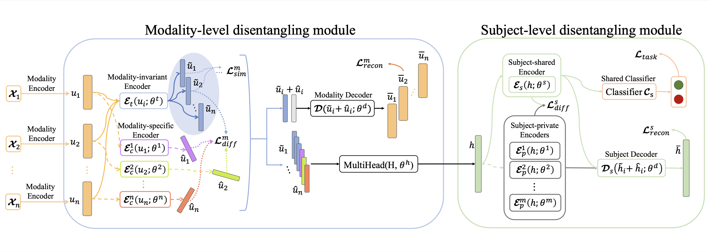

# Multi-level Disentangling Network for Cross-Subject Emotion Recognition (MDNet)

MDNet is a state-of-the-art deep learning model designed for emotion recognition using multimodal physiological signals, with a focus on cross-subject generalizability. This work extends existing methodologies by introducing a dual disentangling mechanism that efficiently captures both modality-invariant and modality-specific features along with subject-shared and subject-private features, enhancing performance in cross-subject settings.


## Publication

This repository contains the implementation of the model described in the paper titled "Multi-level Disentangling Network for Cross-Subject Emotion Recognition based on Multimodal Physiological Signals" by Ziyu Jia, Fengming Zhao, Yuzhe Guo, Hairong Chen, and Tianzi Jiang. 

The paper has been accepted for publication at IJCAI 2024 [[paper]([https://github.com/hairongChenDavid/MDNet](https://www.ijcai.org/proceedings/2024/0340.pdf))].

Code for the model in the paper *Multi-level Disentangling Network for Cross-Subject Emotion Recognition based on Multimodal Physiological Signals* [[github](https://github.com/hairongChenDavid/MDNet)].


## Model Architecture

The architecture of MDNet includes two primary modules:
- **Modality-level disentangling module:** Separates modality-invariant and modality-specific features from multimodal physiological signals.
- **Subject-level disentangling module:** Separates subject-shared and subject-private features to handle individual differences across subjects effectively.


<div align="center">

</div>


## Environment

* CUDA 11.4
* Python 3.8
* Pytorch 2.3.0


## Project Structure

This section outlines the organization of the repository and the purpose of its directories and files to help you navigate and utilize this project effectively.

### Repository Layout

```plaintext
MDNet/
│
├── functions.py
# Part contains loss functions used by MDNet. 
│
├── modality_Encoder.py
# Modality encoder that extract initial features. EEG_Encoder can be  only used to process EEG signals. EOG_Encoder can be adapted to process EOG,ECG,EMG signals.
│
├── models.py                
# Contains the implementation of the MDNet model, detailing the architecture and its functionalities.
│
├── LICENSE                    
# The license file, delineating the terms under which the project can be used.
│
└── README.md                   
# Provides a comprehensive overview of the project, including its purpose, structure, and instructions for setup and usage.
```


## Citation

If you find this useful, please cite our work as follows:

    @inproceedings{jia2024multilevel,
      title={Multi-level Disentangling Network for Cross-Subject Emotion Recognition based on Multimodal Physiological Signals},
      author={Jia, Ziyu and Zhao, Fengming and Guo, Yuzhe and Chen, Hairong and Jiang, Tianzi},
      booktitle={IJCAI 2024},
      year={2024}
    }


## License

- For academic and non-commercial use only
- Apache License 2.0
